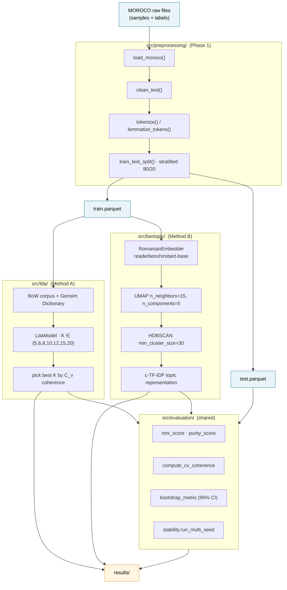
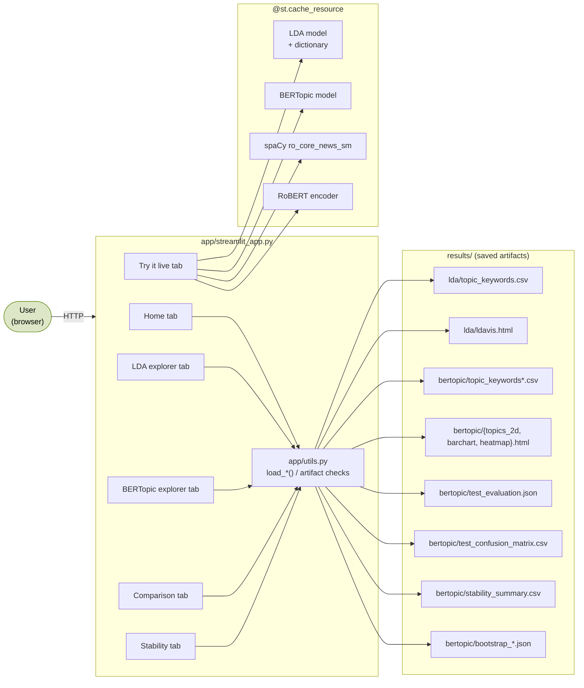
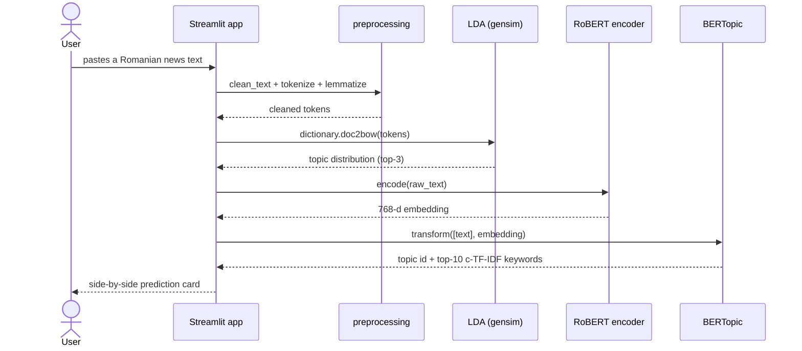

# Application architecture

This document holds the **two diagrams** referenced from the joint report:

- **Pipeline diagram** — how MOROCO becomes saved artifacts (referenced from §2.2 / §3).
- **Application diagram** — how the Streamlit GUI consumes those artifacts (referenced from §2.3).

Both are written in [Mermaid](https://mermaid.js.org/), which renders natively on GitHub and in most LaTeX/Pandoc tooling.

---

## 1. Pipeline diagram

End-to-end flow from raw MOROCO files to the saved artifacts both methods produce. The two method pipelines run independently on the **same** train/test split; they only meet again at the evaluation layer.



### Saved artifacts

| Path | Produced by | Consumed by |
|---|---|---|
| `data/processed/{train,test}.parquet` | preprocessing | both pipelines + the app |
| `results/lda/model_K{N}.gensim` | LDA training (M2.3) | LDA tab in app |
| `results/lda/dictionary.dict`, `corpus.mm` | LDA training (M1.6) | LDA tab in app |
| `results/lda/ldavis.html` | LDA inspection (M3.3) | LDA tab in app |
| `results/lda/topic_keywords.csv` | LDA inspection (M3.1) | LDA tab + Comparison tab |
| `results/bertopic/embeddings_{train,test}.npy` | T1 | T2, T6, app |
| `results/bertopic/model_main/` | T2 | T3, T6, T8, **app live inference** |
| `results/bertopic/topic_keywords.csv`, `topic_keywords_labeled.csv` | T3 | BERTopic tab |
| `results/bertopic/{topics_2d,barchart,heatmap}.html` | T3 | BERTopic tab (embedded) |
| `results/bertopic/hp_sweep.csv` | T4 | Stability tab |
| `results/bertopic/ablation.csv` | T5 | Comparison tab |
| `results/bertopic/test_evaluation.json`, `test_confusion_matrix.csv` | T6 | Comparison tab |
| `results/bertopic/stability_runs.csv`, `stability_summary.csv` | T8 | Stability tab |
| `results/bertopic/bootstrap_{nmi,purity}.json` | T8 | Stability tab |

---

## 2. Application diagram (§2.3)

The Streamlit app is a **read-only frontend**: it never trains a model, it only loads what the pipeline already saved. The single live operation is **encoding a user-supplied text** in the *Try it live* tab, which reuses the trained models.



### How a "Try it live" prediction flows



---

## 3. Graceful degradation

Each tab follows this pattern:

```python
def render() -> None:
    artifact = load_or_none(paths.SOMETHING)
    if artifact is None:
        st.info(
            "This tab needs `results/.../something.csv`. "
            "Run `python scripts/<step>.py` first."
        )
        return
    render_real_content(artifact)
```

Concretely: if Mihai hasn't pushed `data/processed/*` yet, the LDA + Comparison + Try-it-live (LDA half) tabs show a friendly *"data hand-off pending"* card instead of crashing — but the Stability and BERTopic tabs already work end-to-end as soon as the BERTopic pipeline runs.

---

## 4. Re-rendering the diagrams

GitHub renders Mermaid blocks automatically — no action needed in the browser. For the PDF report, the easiest options are:

- **Pandoc + mermaid-filter** (`pandoc report.md --filter mermaid-filter -o report.pdf`).
- **Online renderer**: paste the Mermaid block into [mermaid.live](https://mermaid.live), export PNG/SVG, embed in your final PDF.
- **VS Code Markdown Preview Mermaid Support** extension to confirm the diagrams look right while editing.
